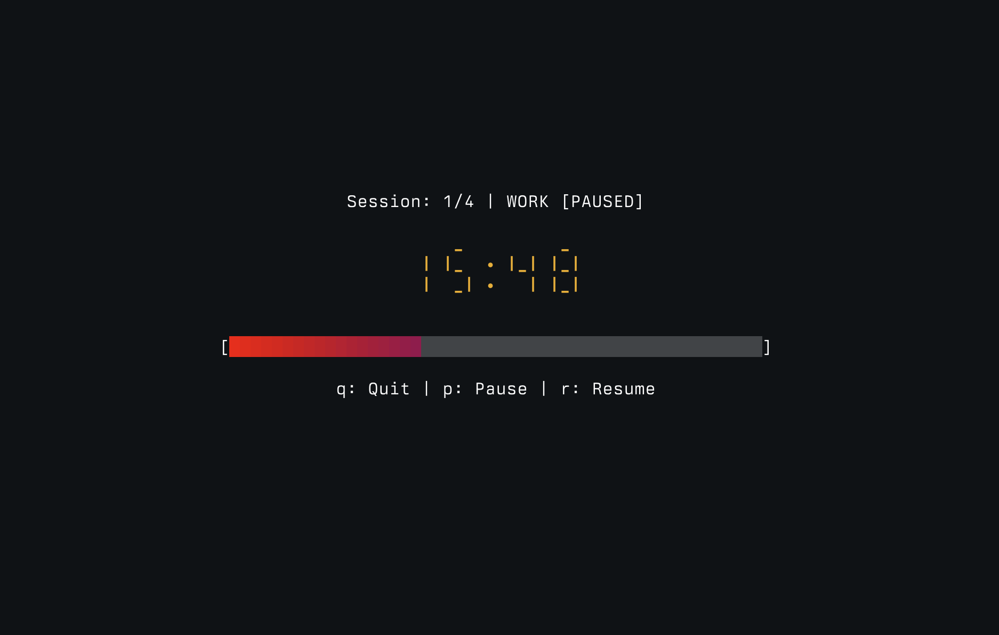

# Pomodoro Timer for the CLI

A terminal-based Pomodoro timer built in Go and a TUI built with [bubbletea](https://github.com/charmbracelet/bubbletea).



## Features

- **Customizable durations** - Set work, break, and long break times
- **Session management** - Specify number of sessions or go infinite
- **Long breaks** - Automatic longer break after every 4 pomodori (work + break cycles)
- **Pause/Resume** - Full control over your timer
- **Cross-platform notifications** - Native OS notifications on macOS, Linux, and Windows
- **Responsive design** - Centered display that adapts to terminal size

## Installation

Requires Go 1.24+ to be installed. Install it [here](https://go.dev/doc/install).

```bash
go install github.com/aileks/pomodoro-timer/cmd/pomodoro@latest
```

Or clone and build:

```bash
git clone https://github.com/aileks/pomodoro-timer
cd pomodoro-timer
go build -o pomodoro ./cmd/pomodoro
./pomodoro
```

## Usage

### Basic Usage

```bash
pomodoro
```

Runs with defaults: 25 min work, 5 min break, 20 min long break, 4 sessions.

### Custom Durations

```bash
pomodoro --work 30 --break 10 --long-break 20 --sessions 8
```

### Flags

- `--work` - Work duration in minutes (default: 25)
- `--break` - Break duration in minutes (default: 5)
- `--long-break` - Long break duration in minutes (default: 15)
- `--sessions` - Number of sessions before exit (default: 4, 0 for infinite)

## Controls

- `p` - Pause timer
- `r` - Resume timer
- `q` - Quit
- `y/n` - Continue or exit after all sessions complete
